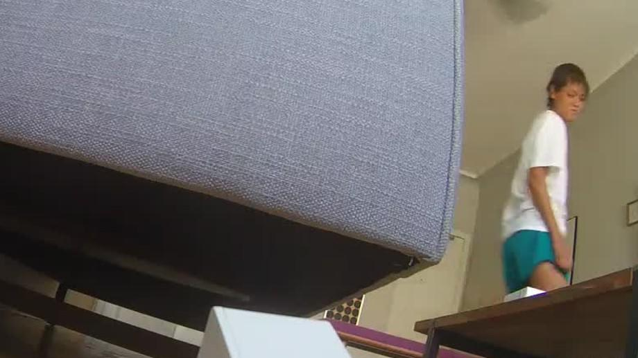

 

# Smart Home
[SFPC Code Societies](http://sfpc.io/codesocieties/), Summer 2018

We will explore home as a place, as an identity, as a practice, and as a series of rituals. What makes someone feel "at home" in a space or in a community (both in person and online)? We will investigate the meaning of home as private space. What happens when networked technologies are brought into this? What roles do surveillance, data collection, automation, and telepresence play? But what is our ideal home of the future? As a class, we will build a smart home on our terms, with each person contributing a device, gesture, piece of furniture, ritual, etc of their design to create an installation throughout sfpc space.
  

## Prep

### Activity
Capture a portrait of yourself in your home using a computational device. Feel free to interpret the words "portrait", "home", and "computational device" broadly. I just googled "computational device" and [this](https://www.cs.drexel.edu/~introcs/F2K/lectures/2.1_computers/examples.html) was the first link that came up. I believe there are a few more examples (including low-tech devices) to be imagined... Please bring the portrait to the first class for discussion.

### Reading
* Kashmir Hill and Surya Mattu, [The House That Spied On Me](https://gizmodo.com/the-house-that-spied-on-me-1822429852)
* Johanna Hedva, [Sick Woman Theory](http://www.maskmagazine.com/not-again/struggle/sick-woman-theory)
  

## Day 1 (August 3, 6:30-9:30pm)

### Capturing Home
We will discuss the portraits of yourselves in your homes that you have captured. We will look at examples of other artists that have captured home using various technologies. How do we know when we are home? Could we write the code for creating a home-space? 

What does it mean to capture a private space? What happens when networked technologies are brought into this? What roles do surveillance, data collection, and telepresence play?

### House Work and Art Work
How do we think about labor in the home? Where is power embedded, and what are strategies for pushing back? How does automation shift the flow of control? We will look at artists dealing with house work, making art work in their homes, and the technologies that accompany these practices.

### Guest Artist: [Max Hawkins](https://maxhawkins.me/)
What if home were algorithmically generated in realtime?

### Home Rituals
What are the rituals we perform when we are at home? How have artists used ritual to create space? We will imagine rituals to turn SPFC into a home-space, and begin to design smart home devices to support these rituals.
1. Write out a description, instructions, or score for your SFPC home ritual.
2. Design a device to facilitate or support this ritual. What will be the function of this device? How will its visual form suggest its purpose? What materials, technologies, non-technologies, or information will you need to create this device?
3. Once you have answered the questions in step 2, collect the materials, things, and information you need to build the device. If you are not able to find the items you need, adapt your design to work with what you can find. You do not need to begin building your device yet, we will have time during day 2, though you may start if you'd like.

### Homework ✨
1. **Home Rituals** If you have not completed steps 1-3 above, please do so before day 2. Bring your plans, designs, and all needed materials to the next class.
2. **Guest and Host** During class you have optionally self selected roles of host or guest, and all guests have been matched with a host. The host and guest(s) are responsible for finding a mutually agreed time to meet up at the home of the host. The term "home" can be interpreted broadly. The host will host the guest(s) at their home for some period of time (it need not be long). They may plan an activity or let the time be free form. Both host and guest are requested to take note of their experience in their role for group discussion on day 2. Note: This activity is not intended to make anyone feel uncomfortable and anyone may opt out at any time. Please communicate with each other if you need to change or opt out after a plan has been made, so nobody is left hanging.
  

## Day 2 (August 10, 5:30-8:30pm)

### Guest and Host
Let's debrief the guest and host activity. What did it feel like and what did you consider as the host? As the guest? What improvisational spaces did these roles create? What limits did them impose? Was there a script followed or run? Could we connect our experiences to ideas of "host" in software or biology?

### Future Home
We will spend most of this day creating our home of the future together, by building the devices designed in the Home Rituals activity. The devices can be installed in the SFPC space for further use and elaboration over the three weeks program.
  

## Going Further
* [references](https://github.com/lmccart/Smart-Home/wiki/References)
* coming soon!

  

