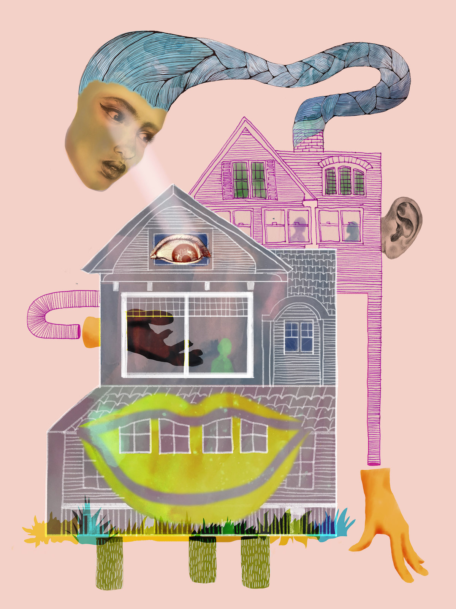

## Smart Home

[SFPC Code Societies](http://sfpc.io/codesocieties/), Summer 2018

We will explore home as a place, as an identity, as a practice, and as a series of rituals. What makes someone feel "at home" in a space or in a community (both in person and online)? We will investigate the meaning of home as private space. What happens when networked technologies are brought into this? What roles do surveillance, data collection, automation, and telepresence play? But what is our ideal home of the future? As a class, we will build a smart home on our terms, with each person contributing a device, gesture, piece of furniture, ritual, etc of their design to create an installation throughout sfpc space.

## Prep Reading
* Kashmir Hill and Surya Mattu, [The House That Spied On Me](https://gizmodo.com/the-house-that-spied-on-me-1822429852)
* Johanna Hedva, [Sick Woman Theory](http://www.maskmagazine.com/not-again/struggle/sick-woman-theory)
* Kate Crawford, [The Anxieties of Big Data](https://thenewinquiry.com/the-anxieties-of-big-data/)

## Prep Assignment
Capture a portrait of yourself in your home using a computational device. Feel free to interpret the words "portrait", "home", and "computational device" broadly. I just googled "computational device" and [this](https://www.cs.drexel.edu/~introcs/F2K/lectures/2.1_computers/examples.html) was the first link that came up. I believe there are a few more examples (including low-tech devices) to be imagined... Please bring the portrait to the first class for discussion.

## Day 1

### Capturing Home
coming soon

### House Work and Art Work
* Helen Molesworth, [House Work and Art Work](http://art310-f11-hoy.wikispaces.umb.edu/file/view/Molesworth+House+Work+and+Art+Work.pdf)
* Mary Maggic, [Housewives Making Drugs](http://maggic.ooo/Housewives-Making-Drugs-2017)
* coming soon

### Home Rituals
coming soon

### ✨ Homework
coming soon

## Day 2

### Guest and Host
coming soon

### Future Home

### Going Further
coming soon

Illustration by [Hilary Hubanks](http://www.hilaryhubanks.com/)

